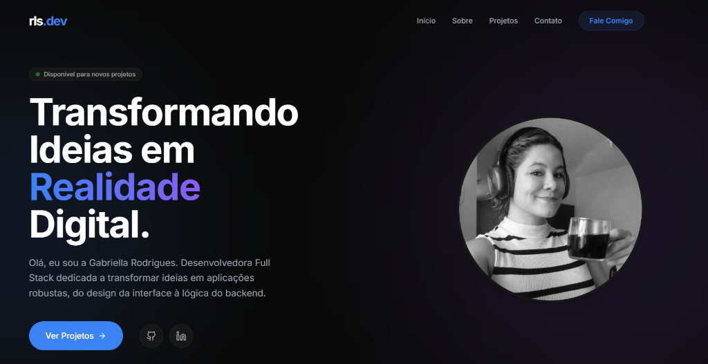

# Portfólio - Gabriella Rodrigues



Bem-vindo(a) ao repositório do meu portfólio pessoal! Este projeto foi desenvolvido para apresentar minhas habilidades como **Desenvolvedora Full Stack e desenvolvimento de Automações**, destacando minha experiência no ecossistema Node.js, automações com n8n e integrações com Inteligência Artificial Generativa.

## 🚀 Visão Geral

O portfólio foi construído com foco em **performance, acessibilidade e design premium**. A interface apresenta um tema escuro profissional com efeitos de _glassmorphism_ e animações fluidas, garantindo uma ótima experiência de usuário em qualquer dispositivo (Mobile First).

### 🛠️ Tecnologias Utilizadas

*   **React** (com Vite)
*   **Tailwind CSS** (Para estilização utilitária e design responsivo)
*   **Lucide React** (Para ícones modernos e leves)
*   **JavaScript (ES6+)**

## 📂 Estrutura do Projeto

O projeto é modularizado de forma limpa:

*   **Navbar**: Navegação fixa com menu responsivo.
*   **Hero**: Bloco principal de introdução com chamadas para ação.
*   **Sobre Mim**: Detalhamento das minhas habilidades principais (Full Stack, Backend, Automação e Escalabilidade).
*   **Projetos**: Galeria interativa dos meus principais trabalhos, como o Agente de IA Financeiro e aplicações dockerizadas.
*   **Contato**: Formulário e links diretos para minhas redes profissionais (LinkedIn, GitHub, Instagram, WhatsApp).

## 💻 Como Rodar Localmente

Siga os passos abaixo para executar o projeto em sua própria máquina:

1.  **Clone o repositório:**
    ```bash
    git clone https://github.com/rlsgabriella/portfolio-gabriella.git
    ```

2.  **Acesse o diretório:**
    ```bash
    cd portfolio-gabriella
    ```

3.  **Instale as dependências:**
    ```bash
    npm install
    ```

4.  **Inicie o servidor de desenvolvimento:**
    ```bash
    npm run dev
    ```

A aplicação estará disponível em `http://localhost:5173/`.

## 📬 Contato

Fique à vontade para entrar em contato comigo para discutir projetos, oportunidades ou parcerias!

*   **Email:** rlsgabriella@gmail.com
*   **LinkedIn:** [https://www.linkedin.com/feed/](https://www.linkedin.com/feed/)
*   **GitHub:** [https://github.com/rlsgabriella](https://github.com/rlsgabriella)
